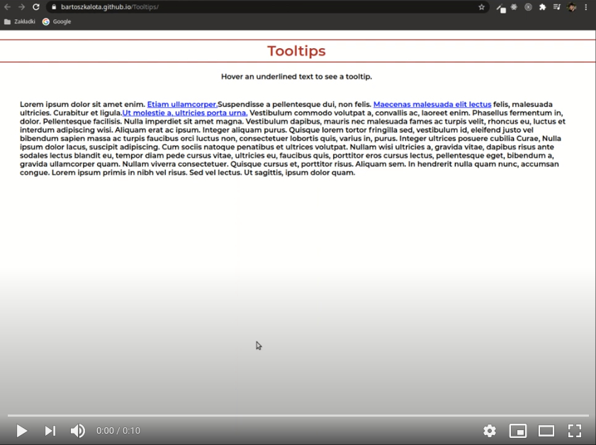

# Tooltips (Workshop-2)
Hover an underlined text to see a tooltip (build with JS (ES5) and CSS). The project is the part of the Coders Lab course.

# Live demo
https://bartoszkalota.github.io/Tooltips/

# Video demo

# Information
The aim of this project was to use JavaScript in ES5 standard. The ES6 standard is utilized in projects including at least Workshop-4 in their titles.

# Technologies
* JS (ES5)
* HTML, CSS